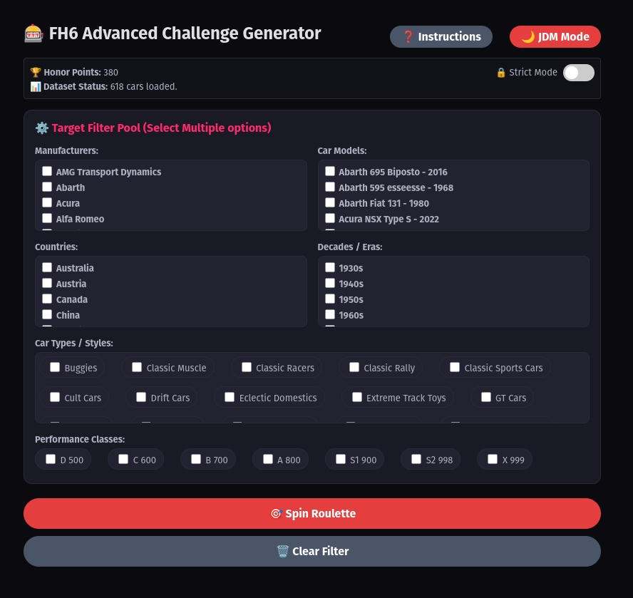

# 🎰 FH6 Advanced Challenge Generator

An interactive, web-based race randomizer built for **Forza Horizon 6** using **Angular**. This tool helps players break the analysis paralysis by generating unique, highly customized driving challenges based on a massive database of vehicles and multiple filtering layers.

*Note: Developed in just a couple of hours during a midnight coding session!* 🏎️💨

---

## 📸 Preview

  

---

## 🚀 Features

- **Massive Embedded Dataset:** Powered by an internal database of **618+ cars** (dynamically loaded and tracked via Angular Signals).
- **Advanced Filtering Pool:** Players can stack multiple restrictions or leave them open to the roulette:
  - 🏢 **Manufacturers & Models:** Deep filtering from Abarth and Acura to Zenvo.
  - 🌍 **Countries:** Tracks car origins automatically using a centralized brand-country dictionary.
  - ⏳ **Decades / Eras:** Sorts cars from the vintage 1930s up to the modern 2020s.
  - 🏎️ **Car Types & Styles:** Supports precise categories like Hot Hatch, Track Toys, Hypercars, Drift Cars, and more.
  - 📊 **Performance Classes:** Supports PI restrictions (`D 500`, `C 600`, `B 700`, `A 800`, `S1 900`, `S2 998`, `X 999`).
- **Smart Weighted Roulette:** Clicking **"Spin Roulette"** triggers a custom randomizer sequence that respects your active filter pools and falls back to "Any Category" dynamically if fields are left unchecked.

---

## 🛠️ Tech Stack

- **Framework:** Angular (v17+ utilizing Modern Features: `@for`/`@if` control flow & `Signals` for state management).
- **Styling:** Inline CSS with embedded animations for the "Selecting Match" pulsing roulette wheel.

---

## 🧹 Code Quality & Roadmap (The "Messy" Corner)

> ⚠️ **Current Status:** *Pure Midnight Spaghetti Code Prototype* 🍝
>
> "To get the MVP up and running in a single night, the entire application—including the 618-car dataset, the brand-country dictionary, the UI template, and the CSS styles—is currently crammed into a single, massive `app.component.ts` file."

### 📅 The "Tomorrow or the Day After" Refactor Plan:
- [ ] **Decouple Data:** Extract `BRANDS_COUNTRIES` and `FH6_CARS_DATABASE` into a dedicated data file (`src/app/data/forza-data.ts`).
- [ ] **Clean the View:** Separate the inline HTML template and CSS styles into independent `.html` and `.css` files to make the component human-readable.
- [ ] **Localization Fix:** Fix a tiny typo in the country dictionary (`'Croacia'` ➡️ `'Croatia'`) to keep the codebase 100% in English.

---

## 📄 License

This project is licensed under the **MIT License** - see the [LICENSE](LICENSE) file for details.
